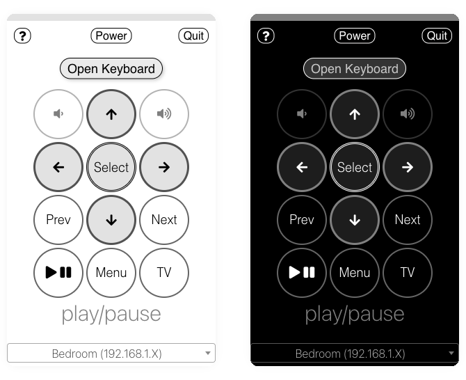

# ATV Desktop Remote

*Feedback or issue? [File an issue](https://github.com/jklewa/atv-desktop-remote/issues)*

A simple menubar app that allows you to control an Apple TV from your desktop

 

## Download

macOS, Windows & Linux releases are available here: [Releases](https://github.com/jklewa/atv-desktop-remote/releases)

## Usage

 1. All of the keys are mapped to the keyboard when the application is open (pressing return or enter on the keyboard for select, delete for Menu, etc).
 2. To see what the characters are mapped to when the application is open, click the question mark icon.

## FAQ

 1. The application cannot be opened (`“ATV Remote.app” is damaged and can’t be opened`)
    * This is an artifact of the macOS quarantine of unsigned applications
    * You can bypass it by running `xattr -c  /Applications/ATV\ Remote.app`
 2. Apple TV will not pair
    * Make sure the Apple TV is on the same network as the computer running the application
    * Make sure `Settings -> AirPlay and HomeKit -> Allow Access` is set to either `Everyone or Anyone on the Same Network` and not `Only People Sharing This Home`
 3. I don't see an option for entering text
    * You may need to pair with your ATV again
    * You have to enter 2 codes instead of 1 because sending text to search fields uses a different protocol
 4. Where is the application's data stored?
    * Mac: `~/Library/Application\ Support/ATV\ Remote/`
    * Windows: `%APPDATA%\ATV Remote`
    * Linux:`~/.local/share/ATV\ Remote/`

## Running

 1. Run `npm install` or `yarn`
 2. Run `npm start` or `yarn start`
 3. The application runs in the menubar. Look for a tiny remote icon and click on it. Right-click for more options.
 4. The first time the app runs it will need to pair with an Apple TV. You can pair with more than one.
 5. Press `CmdOrCtrl+Shift+0` to open the application from anywhere.
    * A `hotkey.txt` with a valid [accelerator](https://www.electronjs.org/docs/api/accelerator) in the application's data directory will override this.

## Building

1. [electron-builder](https://www.electron.build/) is used to create a standalone application
2. `npm run build` builds your local environment
   * `npm run build -- --mac --win --linux` builds macOS, Windows, & Linux
3. Packages are stored in `dist/`
4. Pushing a new release tag (`v1.x.x`) also triggers a build & release with GitHub Actions
5. To update the application's screenshot: `python generate_screenshot.py`
6. To increment the semvar version number: `python fixversion.py 1.2.3`
   * This will prompt you to update package locks in both `.` and `app/`

## Notes

This is a fork of the original project: [bsharper/atv-desktop-remote](https://github.com/bsharper/atv-desktop-remote)

This project is built using [pyatv.](https://pyatv.dev/)

Support the original author **bsharper**:

